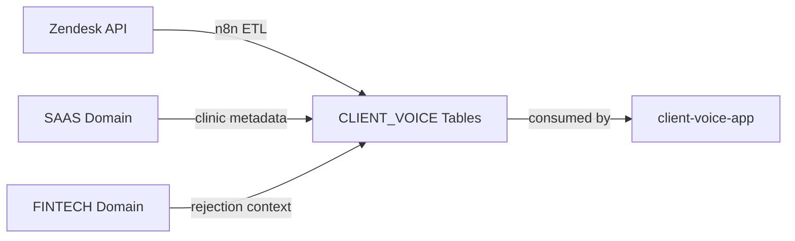

# CLIENT_VOICE Domain — Voice of Customer Data Ontology

> **Domain ID**: CLIENT_VOICE  
> **Status**: Active  
> **Last Updated**: 2026-02-03  
> **Separated From**: client-voice/ (Streamlit app moved to client-voice-app/)

---

## 1. What is this Domain?

The **CLIENT_VOICE** domain handles Voice of Customer (VoC) data from multiple sources:
- **Support Tickets** (Zendesk)
- **Customer Feedback** (NPS, surveys)
- **Sales Interactions** (HubSpot deals - future)
- **Feature Requests** (Upvoty - future)

**Core Philosophy**:
- **LLM-Enhanced ETL**: Classification and sentiment via n8n + LLM
- **Multi-Source Federation**: Consolidate customer voice from disparate systems
- **Cross-Domain Enrichment**: Join with SAAS and FINTECH for context

---

## 2. Relationship to Ecosystem

CLIENT_VOICE is a **data domain** that:
- Maintains its own entities (tickets, comments, users)
- Enriches with data from **SAAS** (clinic metadata)
- Enriches with data from **FINTECH** (rejection reasons, conversion context)
- Feeds **client-voice-app** (Streamlit dashboard)



---

## 3. Core Entities

### Primary Data (Owned by CLIENT_VOICE)

| Entity | Source | Table | Status |
| :--- | :--- | :--- | :--- |
| `ZENDESK_TICKETS` | Zendesk via n8n | `CAPIM_DATA_DEV.POSSANI_SANDBOX.TICKET_ANALYSIS_V3` | Active |
| `ZENDESK_COMMENTS` | Zendesk via n8n | `CAPIM_DATA.CAPIM_ANALYTICS.ZENDESK_COMMENTS` | Active |
| `ZENDESK_USERS` | Zendesk via n8n | `CAPIM_DATA.CAPIM_ANALYTICS.ZENDESK_USERS` | Active |

**Documentation**: See `_docs/reference/*_SEMANTIC.md`

### Cross-Domain Joins

| Source Entity | Target Entity | Join Key | Purpose |
| :--- | :--- | :--- | :--- |
| `TICKETS.clinic_id` | `SAAS.CLINICS` | `clinic_id` | Enrich with clinic metadata |
| `TICKETS.clinic_id` | `FINTECH.CLINICS` | `clinic_id` | Enrich with BNPL eligibility |

---

## 4. Capabilities

What this domain can answer:

| Capability | Description | Inputs | Outputs |
| :--- | :--- | :--- | :--- |
| `TicketVolume` | Count tickets by period | `clinic_id?`, `date_range` | `ticket_count`, `trend` |
| `TicketCategories` | Distribution by category | `clinic_id?`, `date_range` | `category_counts`, `top_issues` |
| `SentimentAnalysis` | Sentiment score distribution | `clinic_id?`, `date_range` | `avg_sentiment`, `distribution` |
| `TicketDetails` | Full ticket content | `ticket_id` | `summary`, `category`, `sentiment` |

**See**: `capim-meta-ontology/federation/CAPABILITY_MATRIX.yaml`

---

## 5. Data Pipeline

```
Zendesk API → n8n Workflow → LLM Classification → Snowflake
                  ↓
            eQEByyVKRHtD4uBa
                  ↓
         TICKET_ANALYSIS_V3
```

**ETL Scripts**: See `scripts/sync_zendesk_enhanced_view.py`

---

## 6. Axioms (Local Constraints)

```yaml
axioms:
  - id: AX-CV-001
    natural_language: "Every ticket must have a category and subcategory after processing."
    formal: "PROCESSED(ticket) => HAS(ticket, category) AND HAS(ticket, subcategory)"
    severity: SOFT
    validation_query: |
      SELECT COUNT(*) FROM CAPIM_DATA_DEV.POSSANI_SANDBOX.TICKET_ANALYSIS_V3
      WHERE categoria IS NULL OR subcategoria IS NULL

  - id: AX-CV-002
    natural_language: "Sentiment score must be between 1 and 5."
    formal: "SENTIMENT(ticket) IN [1, 2, 3, 4, 5]"
    severity: HARD
    validation_query: |
      SELECT COUNT(*) FROM CAPIM_DATA_DEV.POSSANI_SANDBOX.TICKET_ANALYSIS_V3
      WHERE sentimento_score NOT IN (1, 2, 3, 4, 5)
```

**Validate with**: `@validate-axioms` skill

---

## 7. Key Files

| File | Purpose |
| :--- | :--- |
| `_docs/ENTITY_INDEX.yaml` | Entity catalog |
| `_docs/ONTOLOGY_INDEX.yaml` | Ontology metadata |
| `_docs/reference/*_SEMANTIC.md` | Semantic documentation (business context) |
| `_docs/decisions/` | Architecture Decision Records (ADRs) |
| `../docs/reference/*.md` | Data dictionaries (schema, columns) |
| `queries/zendesk/` | SQL queries for Zendesk data |
| `scripts/sync_zendesk_enhanced_view.py` | ETL sync script |

---

## 7b. Documentation Types

| Type | Location | Purpose | Suffix |
| :--- | :--- | :--- | :--- |
| **Semantic** | `_domain/_docs/reference/` | Business context, relationships, rules | `*_SEMANTIC.md` |
| **Data Dictionary** | `docs/reference/` | Schema, columns, data types | `*.md` (no suffix) |
| **ADR** | `_domain/_docs/decisions/` | Architecture decisions | `NNNN-*.md` |

---

## 8. Integration with Meta-Ontology

**Registration**:
- ✅ Domain registered in `capim-meta-ontology/federation/DOMAIN_REGISTRY.yaml`
- ✅ Capabilities in `capim-meta-ontology/federation/CAPABILITY_MATRIX.yaml`

**Consumed by**:
- **client-voice-app** (Streamlit dashboard)
- Cross-domain queries via `@clinic-health-check` skill

---

## 9. Separation from Application Layer

**Previously**: client-voice/ contained both ontology AND Streamlit app (mixed concerns)

**Now** (2026-02-03 separation):
- **This project** (`client-voice-data/`): Data ontology, ETL, queries
- **Separate project** (`client-voice-app/`): Streamlit UI, components, pages

**Rationale**: Aligns with MEMORY_ARCHITECTURE_CONSTITUTION principle of separation of concerns.

---

## 10. Quick Reference

| Resource | Value |
| :--- | :--- |
| **Snowflake Schema** | `CAPIM_DATA_DEV.POSSANI_SANDBOX` |
| **Main Table** | `TICKET_ANALYSIS_V3` |
| **n8n Workflow ID** | `eQEByyVKRHtD4uBa` |
| **Application** | `../client-voice-app/` (Streamlit) |
| **Federation** | Registered in `capim-meta-ontology/federation/` |

---

**Version**: 1.0 (Initial separation from client-voice)  
**Created**: 2026-02-03
