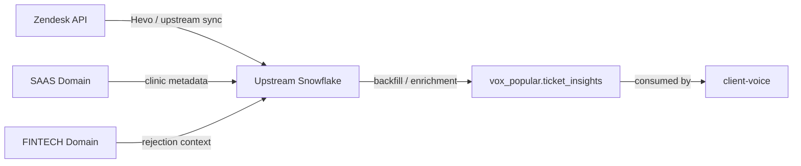

# CLIENT_VOICE Domain — Voice of Customer Data Ontology

> **Domain ID**: CLIENT_VOICE  
> **Status**: Active  
> **Last Updated**: 2026-03-09  
> **Application Pairing**: `../client-voice/` (current Streamlit app)

---

## 1. What is this Domain?

The **CLIENT_VOICE** domain handles Voice of Customer (VoC) data from multiple sources:
- **Support Tickets** (Zendesk)
- **Customer Feedback** (NPS, surveys)
- **Sales Interactions** (HubSpot deals - future)
- **Feature Requests** (Upvoty - future)

**Core Philosophy**:
- **3-Axis Taxonomy**: Produto × Natureza × Atendimento (see `_docs/TAXONOMY_3_AXES.md`)
- **LLM-Enhanced ETL**: Classification and sentiment via Python + Anthropic API (3-tier: Opus/Sonnet/Haiku)
- **Multi-Source Federation**: Consolidate customer voice from disparate systems
- **Cross-Domain Enrichment**: Join with SAAS and FINTECH for context

---

## 2. Relationship to Ecosystem

CLIENT_VOICE is a **data domain** that:
- Maintains its own entities (tickets, comments, users)
- Enriches with data from **SAAS** (clinic metadata)
- Enriches with data from **FINTECH** (rejection reasons, conversion context)
- Feeds **`client-voice/`** (Streamlit dashboard)

**⚠️ CRITICAL ARCHITECTURE DECISIONS**:
- **(2026-02-09)**: **vox_popular (PostgreSQL RDS)** is the **single source of truth** for ticket analysis
- `TICKET_ANALYSIS_V3` (Snowflake sandbox) is **LEGACY** and should NOT be used for new analysis
- All ticket classification, enrichment, and insights stored in `vox_popular.ticket_insights`
- **(2026-02-12)**: **3-Axis Taxonomy** replaces Stage 1+2 keyword-based classification
- Classification: Produto (L1+L2) × Natureza (19 valores v3.2 no universo processado) × Atendimento (4 valores)
- LLM extraction: root_cause, sentiment, key_themes, CES, churn_risk, frustration (7 variáveis)
- Bot identification: `cloudhumans` tag (31.8%) + `transbordo_botweb` (2.1%) + `is_claudinha_assigned` (snapshot)


```mermaid
graph LR
    Zendesk[Zendesk API] -->|Hevo / upstream sync| Snowflake[Upstream Snowflake]
    SAAS[SAAS Domain] -->|clinic metadata| Snowflake
    FINTECH[FINTECH Domain] -->|rejection context| Snowflake
    Snowflake -->|backfill / enrichment| Postgres[vox_popular.ticket_insights]
    Postgres -->|consumed by| CVApp[client-voice]
```

---

## 3. Core Entities

### Primary Data (Owned by CLIENT_VOICE)

| Entity | Source | Table | Status |
| :--- | :--- | :--- | :--- |
| **`TICKET_INSIGHTS`** | Snowflake → PostgreSQL | `vox_popular.ticket_insights` | **Active (primary)** |
| `ZENDESK_TICKETS` | Zendesk via Hevo | `CAPIM_DATA.SOURCE_STAGING.SOURCE_ZENDESK_TICKETS` | Active (upstream) |
| `ZENDESK_COMMENTS` | Zendesk via Hevo | `CAPIM_DATA.SOURCE_STAGING.SOURCE_ZENDESK_COMMENTS` | Active (upstream) |
| `ZENDESK_USERS` | Zendesk via Hevo | `CAPIM_DATA.SOURCE_STAGING.SOURCE_ZENDESK_USERS` | Active (upstream) |
| `TICKET_ANALYSIS_V3` | n8n legacy | `CAPIM_DATA_DEV.POSSANI_SANDBOX.TICKET_ANALYSIS_V3` | **LEGACY** |

**Documentation**: See `_docs/reference/*_SEMANTIC.md`

### Cross-Domain Joins

| Source Entity | Target Entity | Join Key | Purpose |
| :--- | :--- | :--- | :--- |
| `TICKETS.clinic_id` | `SAAS.CLINICS` | `clinic_id` | Enrich with clinic metadata |
| `TICKETS.clinic_id` | `FINTECH.CLINICS` | `clinic_id` | Enrich with BNPL eligibility |

---

## 4. Capabilities

What this domain can answer:

| Capability | Description | Inputs | Outputs |
| :--- | :--- | :--- | :--- |
| `TicketVolume` | Count tickets by period | `clinic_id?`, `date_range` | `ticket_count`, `trend` |
| `ProductAnalysis` | Distribution by Produto (L1/L2) | `clinic_id?`, `date_range` | `product_area`, `product_area_l2` |
| `NatureAnalysis` | Distribution by Natureza (root_cause) | `clinic_id?`, `date_range` | `root_cause` (19 valores v3.2 no universo processado) |
| `AtendimentoAnalysis` | Bot vs Human handling | `clinic_id?`, `date_range` | `service_type` (4 valores) |
| `SentimentAnalysis` | Sentiment + CES + churn risk | `clinic_id?`, `date_range` | `sentiment`, `customer_effort_score`, `churn_risk_flag` |
| `TicketDetails` | Full ticket with LLM enrichment | `ticket_id` | `summary`, `root_cause`, `sentiment`, `key_themes` |

**See**: `capim-meta-ontology/federation/CAPABILITY_MATRIX.yaml`

---

## 5. Data Pipeline

```
Zendesk API → Hevo Sync → Snowflake (SOURCE_STAGING)
                               ↓
                    scripts/backfill_tickets_mvp.py
                               ↓
                    PostgreSQL (vox_popular.ticket_insights)
                               ↓
                    scripts/reprocess_tickets_full_taxonomy.py
                               ↓
                    LLM Extraction (Anthropic API, 3-tier)
                               ↓
                    Deterministic Rules (classify_produto, classify_atendimento)
                               ↓
                    ticket_insights (enriched: 3-axis taxonomy + LLM vars)
```

**ETL Scripts**:
- `scripts/backfill_tickets_mvp.py` — Snowflake → PostgreSQL (171K tickets)
- `scripts/reprocess_tickets_full_taxonomy.py` — LLM extraction + deterministic classification
- `scripts/sync_zendesk_enhanced_view.py` — Legacy sync (TICKET_ANALYSIS_V3)

---

## 6. Axioms (Local Constraints)

```yaml
axioms:
  - id: AX-CV-001
    natural_language: "Every LLM-processed ticket must have root_cause and sentiment."
    formal: "LLM_PROCESSED(ticket) => HAS(ticket, root_cause) AND HAS(ticket, sentiment)"
    severity: SOFT
    validation_query: |
      SELECT COUNT(*) FROM ticket_insights
      WHERE llm_model IS NOT NULL AND (root_cause IS NULL OR sentiment IS NULL)

  - id: AX-CV-002
    natural_language: "Sentiment score must be between 1 and 5."
    formal: "SENTIMENT(ticket) IN [1, 2, 3, 4, 5]"
    severity: HARD
    validation_query: |
      SELECT COUNT(*) FROM ticket_insights
      WHERE sentiment IS NOT NULL AND sentiment NOT IN (1, 2, 3, 4, 5)

  - id: AX-CV-003
    natural_language: "root_cause must stay inside the canonical v3.2 set in the processed universe, while the table still tolerates some legacy compatibility values."
    formal: "root_cause IN check_root_cause_values"
    severity: HARD
    validation_query: |
      -- Enforced by PostgreSQL CHECK constraint plus processed-universe conventions.

  - id: AX-CV-004
    natural_language: "product_area must be BNPL, SaaS, Onboarding, POS, or Indeterminado in the processed universe."
    formal: "product_area IN ['BNPL', 'SaaS', 'Onboarding', 'POS', 'Indeterminado']"
    severity: HARD
    validation_query: |
      SELECT COUNT(*) FROM ticket_insights
      WHERE product_area IS NOT NULL
        AND product_area NOT IN ('BNPL', 'SaaS', 'Onboarding', 'POS', 'Indeterminado')
        AND llm_model IS NOT NULL

  - id: AX-CV-005
    natural_language: "service_type must be one of 4 allowed values."
    formal: "service_type IN ['Bot_Escalado', 'Bot_Resolvido', 'Escalacao_Solicitada', 'Humano_Direto']"
    severity: HARD
    validation_query: |
      SELECT COUNT(*) FROM ticket_insights
      WHERE service_type IS NOT NULL
        AND service_type NOT IN ('Bot_Escalado', 'Bot_Resolvido', 'Escalacao_Solicitada', 'Humano_Direto')
```

**Validate with**: `@validate-axioms` skill

---

## 7. Key Files

| File | Purpose |
| :--- | :--- |
| `_docs/ENTITY_INDEX.yaml` | Entity catalog |
| `_docs/ONTOLOGY_INDEX.yaml` | Ontology metadata |
| `_docs/reference/*_SEMANTIC.md` | Semantic documentation (business context) |
| `_docs/decisions/` | Architecture Decision Records (ADRs) |
| `../docs/reference/*.md` | Data dictionaries (schema, columns) |
| `queries/zendesk/` | SQL queries for Zendesk data |
| `scripts/sync_zendesk_enhanced_view.py` | ETL sync script |

---

## 7b. Documentation Types

| Type | Location | Purpose | Suffix |
| :--- | :--- | :--- | :--- |
| **Semantic** | `_domain/_docs/reference/` | Business context, relationships, rules | `*_SEMANTIC.md` |
| **Data Dictionary** | `docs/reference/` | Schema, columns, data types | `*.md` (no suffix) |
| **ADR** | `_domain/_docs/decisions/` | Architecture decisions | `NNNN-*.md` |

---

## 8. Integration with Meta-Ontology

**Registration**:
- ✅ Domain registered in `capim-meta-ontology/federation/DOMAIN_REGISTRY.yaml`
- ✅ Capabilities in `capim-meta-ontology/federation/CAPABILITY_MATRIX.yaml`

**Consumed by**:
- **`client-voice/`** (Streamlit dashboard)
- Cross-domain queries via `@clinic-health-check` skill

---

## 9. Separation from Application Layer

**Previously**: `client-voice/` contained both ontology and Streamlit app (mixed concerns)

**Now**:
- **This project** (`client-voice-data/`): Data ontology, ETL, queries
- **Separate project** (`client-voice/`): Streamlit UI, components, pages

**Rationale**: Aligns with MEMORY_ARCHITECTURE_CONSTITUTION principle of separation of concerns.

---

## 10. Quick Reference

| Resource | Value |
| :--- | :--- |
| **PostgreSQL** | `vox_popular.ticket_insights` (primary, 171K rows) |
| **Snowflake Schema** | `CAPIM_DATA_DEV.POSSANI_SANDBOX` (upstream sources) |
| **Legacy Table** | `TICKET_ANALYSIS_V3` (DEPRECATED — use ticket_insights) |
| **Taxonomy** | `_docs/TAXONOMY_3_AXES.md` (Produto × Natureza × Atendimento) |
| **Application** | `../client-voice/` (Streamlit) |
| **Federation** | Registered in `capim-meta-ontology/federation/` |

---

**Version**: 2.1 (audit-aligned domain entrypoint)  
**Created**: 2026-02-03  
**Updated**: 2026-03-09
